# 🚀 SoC RISC-V: An ASIC Implementation of the FEMTORV32
> #### 🛠️ Designed by Felipe Ferreira Nascimento, São Paulo, Brazil.

---
## 🌐 Overview
The RISC-V architecture, an open-source ISA licensed under the Berkeley Software Distribution (BSD), has been gaining global recognition both in academic circles and in the market. The streamlined and expandable instruction set of this architecture allows for the implementation of versatile microarchitectures, suitable for both specific applications and general use. This project is dedicated to the full physical implementation of a SoC based on the RISC-V architecture, building on the FemtoRV32 project. The Quark core, which runs the base RV32I instruction set, was chosen for this implementation. This work is among the first to complete a full physical implementation of the Quark core, offering a validated microarchitecture that can be used in future ASIC projects. The initial implementation was carried out on a low-cost iCESugar-nano FPGA and was later transitioned to a 180 nm CMOS technology. The results show that the Quark core is a feasible option for cost-effective microprocessor projects, operating at frequencies above 120 MHz. One of the highlights of this project was the implementation of an automated testing environment, providing a framework for validation that spans from the front-end phase to the back-end. With the chip already in hand, future power characterization tests and other analyses are planned, aiming to assess the strengths and areas for improvement of the SoC.

## ⭐ Advancements and Innovations in ASIC Technology Based on the RISC-V Architecture
The FemtoRV32 project focuses on the implementation of RISC-V processors and is derived from the renowned PicoRV32, optimized for RISC-V CPUs, serving as a foundation for innovations in this architecture, as exemplified by the Raven SoC [Raven](https://github.com/efabless/raven-picorv32). This, in turn, underwent physical implementation and chip fabrication through the open silicon PDK from Efabless, using a 180 nm CMOS process. However, the results of the physical synthesis and consumption estimates are not available. This process actualized and made the PicoRV32 project feasible in a real implementation, highlighting the core's versatility for reuse in ASIC projects. Thus, this project aimed to expand these possibilities for the FemtoRV32 project, providing significant contributions so it can serve as a solid foundation in the development of new solutions. This is the first work that undertook such an initiative.

🔗 [FemtoRV32 Project](https://github.com/BrunoLevy/learn-fpga/tree/master/FemtoRV)
- 📄 Copyright (c) 2020-2021, Bruno Levy
- 📜 All rights reserved.

---
### 🔎 Contextualization
Although the ARM and x86 architectures are widely used, their restrictive licensing model poses a barrier to academic and experimental exploration. Developing a microprocessor is already, in itself, a task that involves multiple complex stages. Furthermore, the licensing constraints of these architectures often result in significant costs. On the other hand, the RISC-V ISA, with its open-source model, provides a more flexible alternative. This allows companies and academic institutions to develop customized microprocessors without the complications associated with intellectual property licenses. This open environment encourages investment in research and development.
However, the physical implementation of RISC-V processors remains a significant challenge. Many microarchitectures, even when validated in simulations or FPGAs, do not proceed to application in actual manufacturing technologies. This gap is largely due to the complexity and costs associated with creating and manufacturing an operational silicon chip. Actual VLSI design involves several intricate phases, from chip design and layout to post-layout checks and simulations. Therefore, it's essential to validate the feasibility of RISC-V microarchitectures in practical contexts, taking into account the real-world physical constraints that differ significantly from ideal conditions in simulations and FPGAs.

---
## 🤔 Motivation
The open-source RISC-V architecture promotes innovation and freedom in the microelectronics field, benefiting both individuals and the community. It allows manufacturers to develop products with intellectual property while retaining the flexibility to implement non-standard instruction subsets. This environment stimulates investment in research and development, driving innovation from startups to large corporations. Renowned companies like Google, IBM, Nvidia, and Samsung are among the investors in the RISC-V Foundation.
The rising global significance of RISC-V and open-source development led the Aeronautics Institute of Technology (ITA) to launch the "ITA CORES" initiative in 2022. Focused on research about the design and fabrication of digital processors based on the RISC-V ISA, this initiative aligns with global trends and the demand for more accessible and innovative technologies.
Physical implementation in CMOS technology not only validates performance and energy efficiency but also ensures the processor's quality and reliability in a context similar to commercial products. Comparative analyses between different implementations of the same microarchitecture provide opportunities for future enhancements.
Given the complexities of the digital flow and the scarcity of material in the current Brazilian literature, there is a clear need to document this information. Such documentation can accelerate the learning of students interested in microelectronics, filling a significant gap in the educational landscape.
The exploration of these topics serves as a hands-on example for students and researchers interested in the RISC-V ISA and SoC design. Sharing information and experiences has the potential to broaden knowledge about this open architecture, and it is believed that this initiative can encourage the community to collaborate in the development of innovative solutions based on RISC-V.

---
## 🌟 ITA-CORES Initiative
Acknowledging the global advancements in RISC-V and Open Source, ITA introduced the "ITA CORES" initiative focusing on designing and manufacturing digital processors based on the RISC-V ISA.

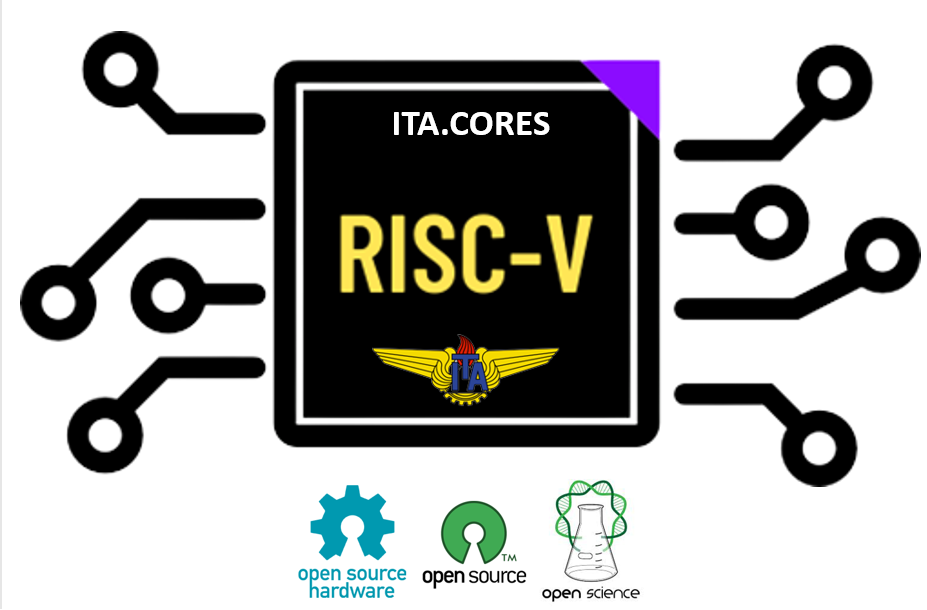

---
## 🧠 SoC RISC-V Implementation
The foundation for the development of this SoC is the FemtoRV32 project, which encompasses the RISC-V core known as Quark. The single-cycle microarchitecture of Quark, consisting of fetch, decode, register read, execute, and write-back stages, stands out for its minimalist and compact structure.
With the assistance of open-source tools based on the IceStorm project, the SoC was synthesized on a low-cost iCESugar-nano FPGA, which only has 1,280 logic elements and is priced under 5 dollars. The maximum operating frequency achieved was 48 MHz.
The FemtoRV32 leverages aspects of the PicoRV32 SoC implementation. Additionally, this work included the integration of a PWM module into the SoC, making it suitable for small embedded systems. The system block diagram is presented below.

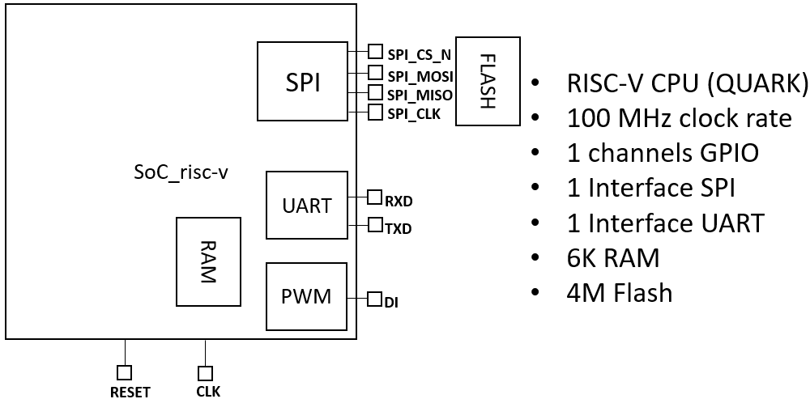

---
## 📚 Ensuring Quark Core Compliance
This project aimed to address a significant gap identified in the Quark core: the lack of comprehensive compliance tests. Such tests are imperative to ensure that the core's implementation aligns with the RISC-V architecture specifications.
Compliance tests, or instruction set architecture (ISA) compliance tests, are vital for validating processors and microcontrollers, assessing whether a processor's implementation adheres correctly to the ISA specification.
In the context of the original Quark core, no compliance tests were applied for core validation, highlighting an urgent need to implement these tests to ensure conformity with RISC-V specifications.
These tests operate by providing a sequence of instructions to the processor and verifying if the output, or the processor's state after instruction execution, is as expected. This might involve checking values in specific registers, memory state, and other processor features.
Compliance tests carry inherent importance, as they offer several crucial advantages:
- **Processor Correctness**: Compliance tests ensure that the processor executes all instructions as specified by the ISA. This is vital to ensure that the processor produces the expected results for a given program.
- **Interoperability**: Adhering to the ISA specification is essential for interoperability, allowing software to be efficiently ported across different implementations of the same instruction set.
- **Diagnosis and Debugging**: Compliance tests also aid in identifying and diagnosing issues. If an implementation fails a compliance test, developers receive a clear signal that there's an error in how the implementation handles the instruction or the set of instructions under test.
- **Facilitation of Maintenance and Design Evolution**: Well-structured compliance tests enable easier comparison between different design versions, providing a consistent baseline for expected functionality.

To ensure Quark core's compliance with RISC-V specifications, two distinct test sets were employed, known for their thoroughness and accuracy in verifying RISC-V implementations' functionality and correctness.
The first set, sourced from the official RISC-V repository [riscv-tests](https://github.com/riscv-software-src/riscv-tests), provides a set of tests aiming to validate each instruction specified in the ISA, ensuring its correct interpretation and execution.

Additionally, a second test set, originating from the lowRISC project [lowriscv](https://github.com/lowRISC/riscv-compliance/tree/master), was applied. This set organizes the tests into distinct suites, each aimed at a different aspect of the RISC-V specifications. The RV32I suite was executed, which achieves a test coverage of 97.23% and includes enhancements implemented in November 2019 by Imperas.


---
## 🛠 Development of the Framework for Test Execution and Validation
Automated testing is crucial, offering significant advantages over manual methods. It not only reduces the need for human intervention in repetitive tests, allowing designers to focus on more complex tasks but also speeds up test execution and ensures its consistency, mitigating human errors.
In this project, a framework was developed, creating a testing environment aimed at verifying the Quark core's compliance with the RISC-V ISA specifications. This environment, detailed in the figure below, encompasses not only compliance tests but also other tests mentioned later, ensuring the validity and efficacy of the RISC-V SoC implementation. The system was structured in various stages and components, simplifying the execution of the tests and ensuring accurate and reliable results.
In the development of a digital chip, it's common for the original design representation to be modified throughout the process. These modifications arise from various optimization stages aiming to enhance system performance, reduce power consumption, and minimize the chip's physical size, among other goals. However, even minor changes might inadvertently introduce errors or inconsistencies, jeopardizing the design's correctness and reliability.
In this context, a regression testing strategy was adopted, employing the same tests at different development stages to ensure recent modifications do not compromise already validated functionalities. This method is versatile, applicable from the early front-end simulation phases to the more advanced back-end stages, such as gate-level simulations in the signoff stage and post-silicon validation.

---
## 🌀 Functioning and steps of the framework
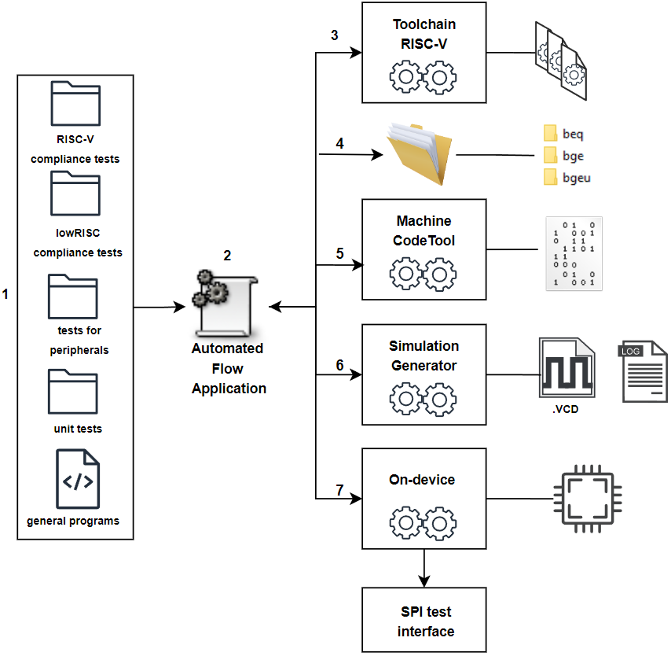

**Stage 1: Test File Management** - The system identifies and manages the test files to be applied. These files are stored in five main repositories, and the system supports test files written in both C language and RISC-V assembly. Below, the directories are described:

1. **RISC-V Compliance Test Repository:** This repository contains files and dependencies exclusively intended for RISC-V compliance tests, as specified in the official RISC-V test repository.

2. **LowRISC Compliance Test Repository:** This repository contains compliance tests that complement the RISC-V compliance tests and address specifics of the LowRISC project.

3. **Peripheral and Communication Test Firmware Repository:** This repository houses firmware intended for peripheral testing.

4. **Unit Test File Repository:** This repository contains test files intended for general or unit tests.

5. **General Program Repository:** This repository stores programs for demonstrations, benchmarks, among others.

---
**Stage 2: Test Environment Setup** - At this stage, the application prepares the automated testing environment through a series of specialized scripts. These scripts perform various functions, from preparing input data to validating the final results.

The framework provides five distinct commands, each related to one of the repositories described in Stage 1. The following list details the function of each command:

1. **make riscv-tests:** Initiates the preparation of compliance tests for the RISC-V architecture. This command fetches the necessary test files from the respective repository and sets up the environment for executing these tests.
   
2. **make riscv-test-suite:** Similar to the previous command but oriented toward the LowRISC project's compliance tests. It also fetches test files from the respective repository and sets up the testing environment.
   
3. **make test-peripherals:** Employed when tests focus on the system's peripherals and communication. Retrieves from the respective repository the firmware developed for these tests and sets up the testing environment.
   
4. **make unit-tests:** Executes unit tests or general tests that aren't specific to any subsystem.
   
5. **make general-programs:** Prepares programs that might not be specifically for tests but can be useful for demonstrations, benchmarks, or other activities. This command fetches the relevant programs from the corresponding repository and sets up the environment for their execution.

---
**Stage 3: Compilation with the RISC-V Toolchain** - In this phase, the application uses the RISC-V toolchain to transform the test files into executable machine code. This toolchain is a set of specialized development tools for the RISC-V architecture, including compilers, assemblers, and linkers. It works on files stored in the repositories mentioned in Stage 1 and passed to the application through Stage 2 commands, converting the source code into assembly codes and executables compatible with the RISC-V architecture.

---
**Stage 4: Organization of Compiled Files** - In this stage, the files compiled in Stage 3 and their necessary dependencies for execution and validation are organized into specific directories for each test. The aim is to simplify reference and access to these files during test execution. Each directory contains all elements related to the corresponding test, including binaries, hexadecimal files, and .vcd files. This organization avoids confusion and ensures the correct linking of all dependencies, making the test execution process more accessible and efficient.

---
**Stage 5: Preparation of Simulation Instructions** - After compilation, the resulting .elf files are converted into hexadecimal format instructions. This process ensures the instructions are correctly formatted to be interpreted by the specific digital simulators used in the project: Icarus Verilog or Xcelium.

The aim of this stage is to prepare the instructions for the simulation stage, ensuring they are understandable for the digital simulators. Formatting failures can prevent test execution on simulators and, consequently, hamper the verification of the implemented project's correctness. Therefore, this stage aims to ensure tests can be executed without issues in subsequent stages.

---
**Stage 6: Automated Test Execution and Validation** - This stage encompasses the automated execution and validation of each test. Once converted, the instructions are tested on the RISC-V SoC with the help of Icarus Verilog or Xcelium software. In the context of compliance tests, all necessary tests for each RV32I instruction are executed. During this process, the strings "PASS" or "FAIL" are recorded at specific memory addresses to signal the success or failure of a test.

During test execution, visual feedback is provided through the D1 pin, corresponding to the PWM output. A successful test triggers a toggle effect on this pin at a frequency of 1 Hz, while a failed test results in a frequency of 2 Hz. This mechanism facilitates user interaction by providing an immediate visual signal of the test status.

---
**Stage 7: Execution of Tests on Physical Device** - This stage involves setting

 up and executing the tests on hardware, such as an FPGA or physical chip. The main task is converting the compiled tests to a binary format suitable for the device.

For test execution, there are two options:

1. **External Flash Memory:** The tests are loaded and executed from the device's external flash memory.
2. **SPI Test Interface:** Alternatively, tests can be loaded through the Verilog module "SPI Test Interface", embedded in an auxiliary FPGA. This module acts as a debugging and communication interface with the RISC-V SoC and eliminates the need for external flash memory.

The "SPI Test Interface," developed in Verilog for this work, serves as hardware representation, capable of emulating memory with a SPI interface and integrating into the existing framework. This feature allows the RISC-V SoC to process external instructions, facilitating test execution at any stage of the physical implementation's development since the SoC only needs to read the instructions to be executed.

---
## 🛠 SPI Teste Interface
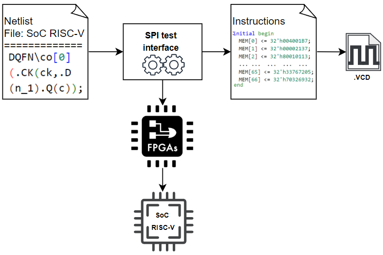

The "SPI Test Interface," developed in Verilog for this work, serves as a hardware representation, capable of emulating memory with a SPI interface and integrating into the existing framework. This feature allows the RISC-V SoC to process external instructions, facilitating test execution at any stage of the physical implementation's development, as the SoC only needs to read the instructions to be executed.

This component, integrated into the testing environment, allows the SoC to execute instructions directly at any development stage. The first file can symbolize a netlist of the RISC-V SoC or the physical implementation, proving useful in gate-level simulations and can also represent the RTL representation of the SoC. The module instantiates the SoC, maps instructions to the simulation environment, and generates ".VCD" files for simulation (e.g., using the Icarus software). Alternatively, it can be synthesized on an FPGA and communicate via SPI with the SoC (chip) to execute instructions.

---
## 🛠 Physical Implementation
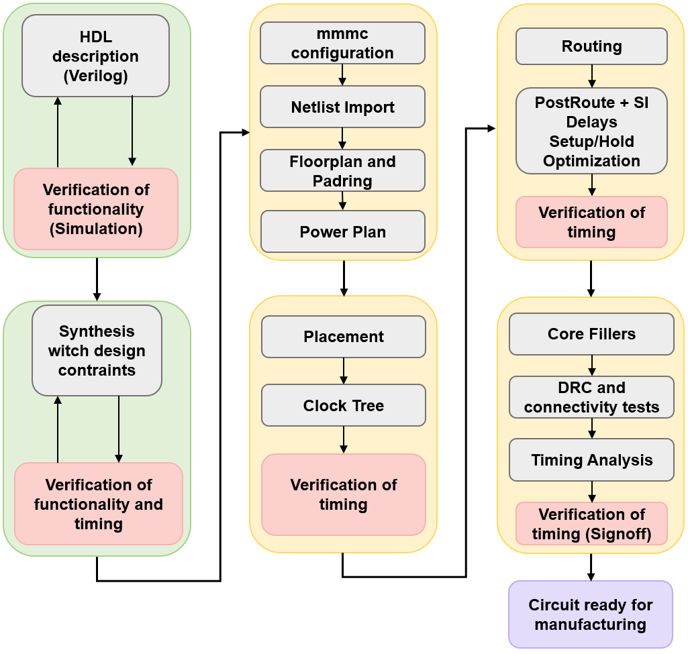
Typical phases in the process of creating a digital chip, applied in the physical implementation of the RISC-V SoC. The process begins with the circuit description and functional simulations to verify the circuit's behavior. Subsequently, the synthesis phase is approached, where new functionality and timing checks are conducted. Before starting the physical implementation, an MMMC (Multi-Mode Multi-Corner) configuration file with a ".view" extension is defined. Following this, the netlist is imported, initiating the floorplan, padring, and power planning phases. Subsequent steps include cell placement, clock tree synthesis (CTS), routing, and post-routing. During these phases, new timing checks are conducted, filler cells are added in the core region, and various analyses such as connectivity and DRC are undertaken, culminating in the signoff stage.

---
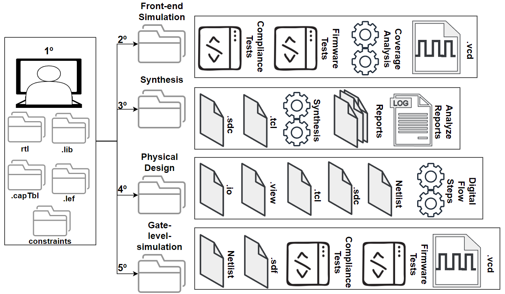

Structure and organization adopted: (1) Technology files; (2) Design tests and validation; (3) Synthesis and associated files; (4) Layout representation and corresponding files; (5) Gate-level simulation validation and related files.

---


Phases of the digital flow carried out in the RISC-V SoC design. The image illustrates the evolution of the design throughout the main stages of the physical implementation performed. In the floorplanning stage, the rows are outlined based on the sites defined by the technology, as well as the positioning of the pad cells and corners. During the Power Planning phase, power rails and the Pad Ring are identified. The Post-Placement phase displays the design state after the cell placement and routing. Lastly, the final part of the figure presents the design after the routing stage, taking into account the optimizations made.

---
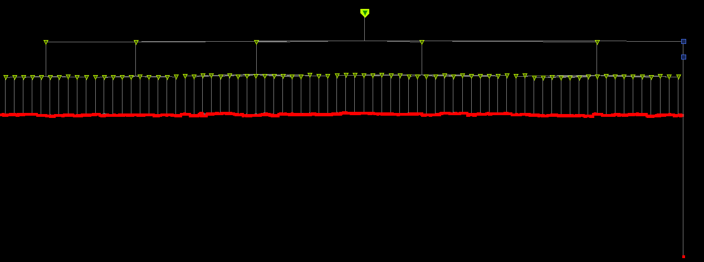

Clock tree in the RISC-V SoC design. The figure showcases the balanced clock tree developed for the RISC-V SoC. The symmetry and regularity of the structure stand out, which are typical attributes of a balanced clock tree. This optimized configuration ensures that the design operates at the specified frequency, meeting timing constraints.


---
## 🛠 Simulation examples
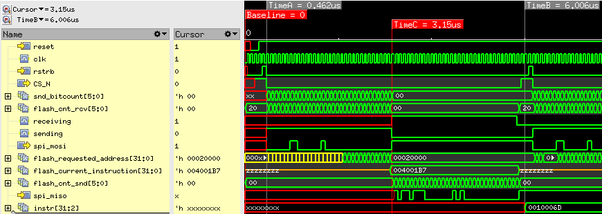
SPI Teste Interface

---
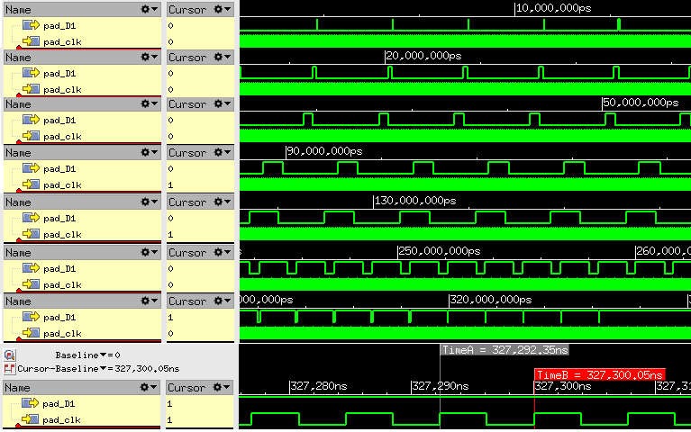
pwm peripheral gate level simulation

---
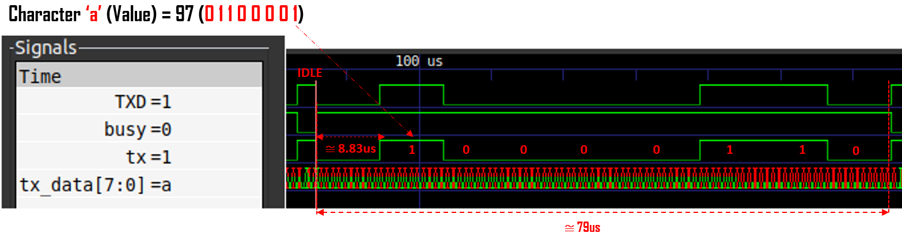
Simulation of the UART peripheral carried out in the Icarus Verilog software. The segment shown was taken from the simulation of word sending via UART. For simplification purposes, the image focuses on the transmission interval of the ASCII character 'a', which corresponds to the binary value '01100001'. A sampling time of approximately 8.63 μs is observed and a total send time of approximately 79 μs for the transmission of the character through the TXD output pin of the SoC.

---
## 🛠 Physical Implementation Results
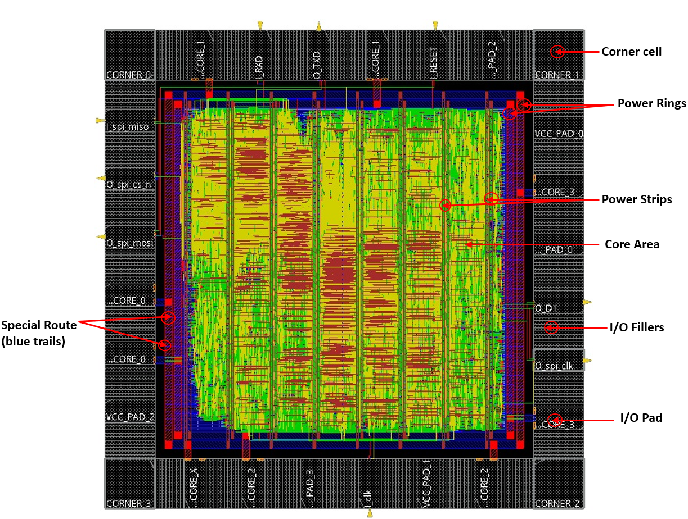

---
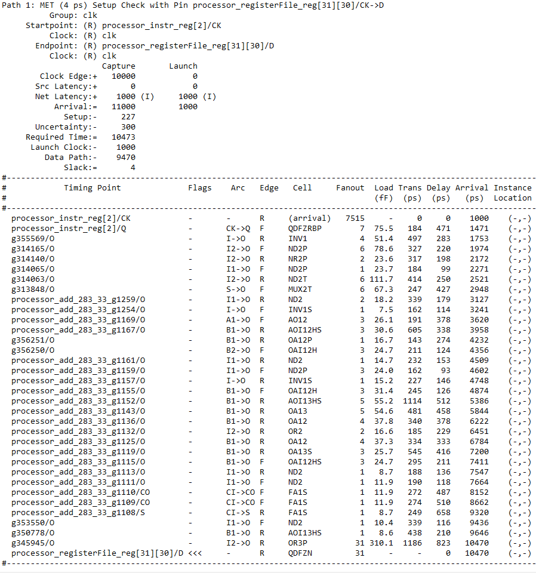

---
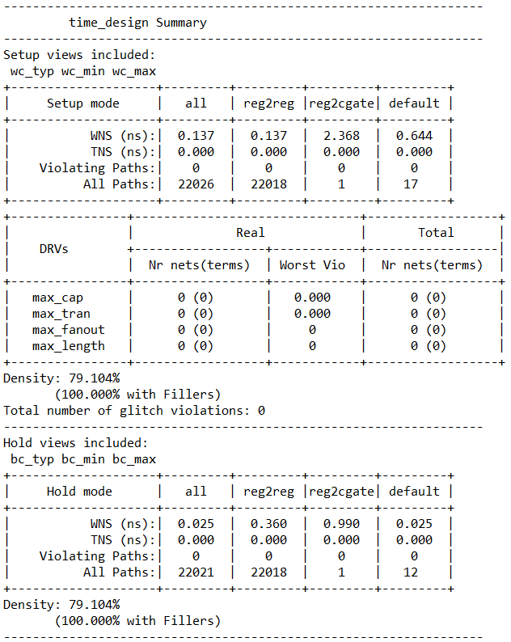

---
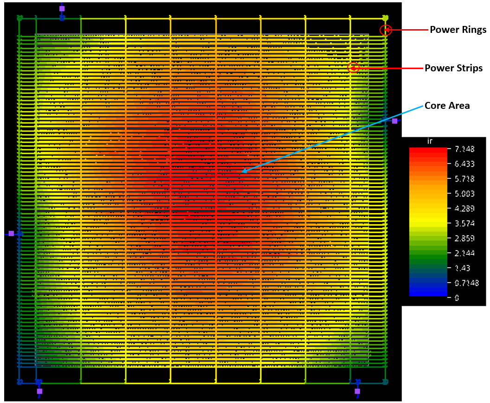
Analysis of IR drop. When analyzing the figure, it is observed that the maximum voltage drop of the RISC-V SoC is approximately 7.15 mW. The analysis was carried out specifying the worst-case at the nominal voltage of 1.62 V, as specified by the technology. The typical acceptable value is 1.8 V, and the maximum value is 1.98 V. Therefore, the voltage drop is relatively small, considering that the analysis frequency is 100 MHz for the worst-case corner.

---
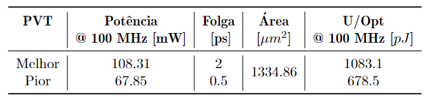

---
## ✅ Chip completion
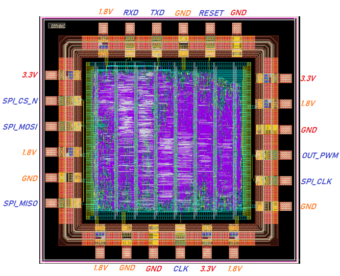

Tap-Out
---
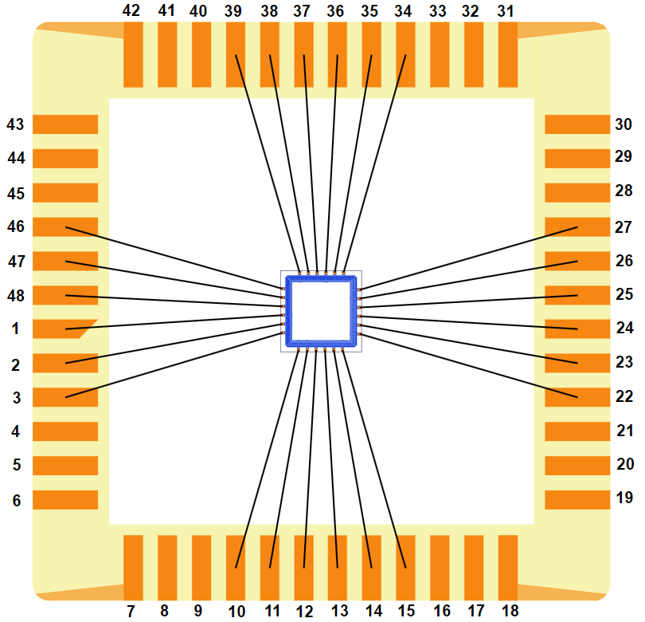

---
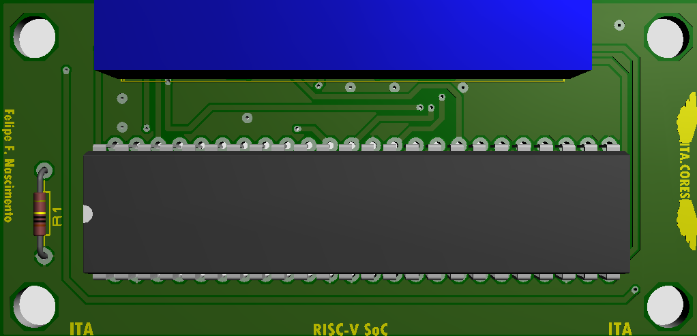

## 🛠 Requirements
To simulate the SoC, the following tools are needed:

Linux/Ubuntu 20.04 LTS distro.
- Icarus Verilog
- GtkWave

## Setting up the RISC-V RV32I Toolchain
   To compile the tests, it's essential to install the RISC-V RV32I toolchain. This installation ensures that the specific version is compatible with the particular compilation requirements for the formats used in the tests.

> 🔔 **Note**: The installation instructions come from the [Picorv32](https://github.com/YosysHQ/picorv32) repository. The installation process can take at least 3 hours, depending on your computer's hardware configuration.

**RISC-V GNU toolchain and libraries:**

```bash
   sudo apt-get install autoconf automake autotools-dev curl libmpc-dev \
   libmpfr-dev libgmp-dev gawk build-essential bison flex texinfo \
   gperf libtool patchutils bc zlib1g-dev git libexpat1-dev
   sudo mkdir /opt/riscv32i
   sudo chown $USER /opt/riscv32i
   git clone https://github.com/riscv/riscv-gnu-toolchain riscv-gnu-toolchain-rv32i
   cd riscv-gnu-toolchain-rv32i
   git checkout 411d134
   git submodule update --init --recursive
   mkdir build; cd build
   ../configure --with-arch=rv32i --prefix=/opt/riscv32i
   make -j$(nproc)
```
🛠️ **Setting up the Tool for iCE40 Open Source**
   
   After installing the toolchain, download the necessary tools for use and deployment on iCE40 Open Source type boards. Follow the detailed instructions in the repository [dloubach-ice40-opensource](https://github.com/dloubach/ice40-opensource-toolchain). Start with the **FTDI drives** item and continue to the **icesprog** item

⚠️ **Important**:
   
   If you encounter warning messages during the process, it might be because your development environment does not meet all the necessary requirements. Use the error messages as a guide to identify and address any dependencies that may arise.

✅ **Installation Verification**
   
   Once the installation is complete, navigate to the `FemtoRV/` directory and run: `make icesugar_nano`

---
## 🛠 Framework Execution Guide

### 📁 Directory Preparation

1. **Initial Setup**  
   Navigate to the directory: `femtorv32/FemtoRV/Frontend/scripts`. This repository stores the main codes used in the development of the framework.

2. **Framework Construction**  
   In your terminal (ensure you're in the path indicated above), type:  `sudo make all ENV_FRONTEND_SIGNOFF=1`
   This command constructs the framework, primarily considering the environment for simulation execution. This step encompasses the compilation of files and dependencies essential for the framework's execution.
   Upon completion, a `bin` folder will be created in the `/scripts/bin` directory, storing the compiled binaries.

### 🖥 Framework Interface
   
   Upon the successful setup, running the framework will display a user interface showcasing the available functions.

   For a practical demonstration, the image below showcases the interface when executing the official RISC-V conformity tests, i.e., option 1.

   

### 📂 File Organization & Test Execution

   After test execution, you can locate the generated files in the `../build` directory. This directory organizes each test individually, identified by their respective names.

   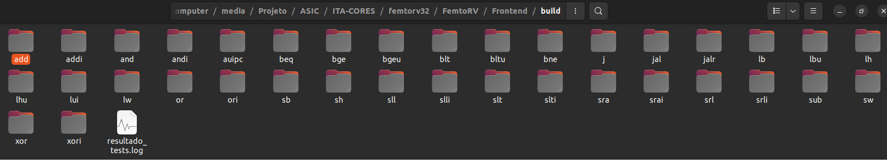

   When accessing a specific test directory, the following file structure can be observed:

   - `.bin` - Binary file for physical devices.
   - `.elf` - Executable and linkable file.
   - `.hex` - Executable instruction file.
   - `_firmware.hex` - Formatted file for digital simulators.
   - `_firmware_spi.v` - SPI interface file.
   - `testbench_XD.vcd` - Resulting simulation file.

   For example, the `ADD` instruction test might present:

   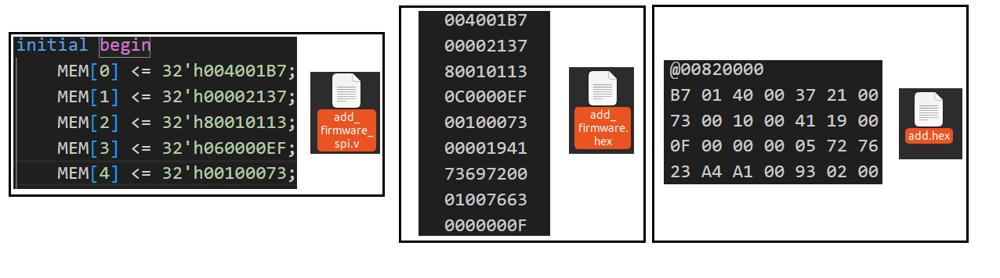

   Following the test's completion, the resulting log file can be found in `../build`. Utility and linker files for the processor are located in `../firmware`, while intermediary files for test execution are in `../test_repository_name/base_testbench`. Where 'teste_repository_name' refers to the name of the repository that stores the tests in question.

   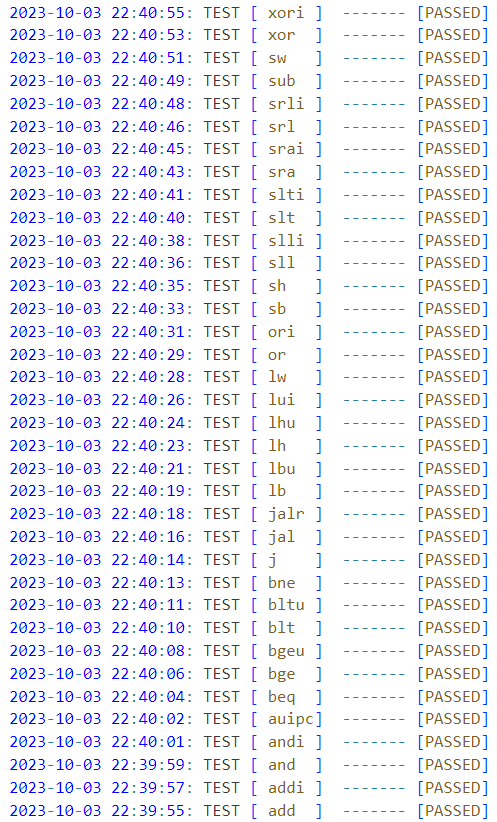


   For execution tests related to the LowRISC project, consider:

   1. Navigate to the directory: `femtorv32/FemtoRV/Frontend/scripts`.
   2. In your terminal, type: `sudo make all ENV_FRONTEND_SIGNOFF=1`.
   3. Select option 2. The necessary dependencies will be verified.
   4. The following image illustrates a sample execution, where several operations are performed. Ultimately, a signature is generated and compared with the reference signature found in `../riscv-test-suite/references`. Test coverages can also be located in this repository.

   

   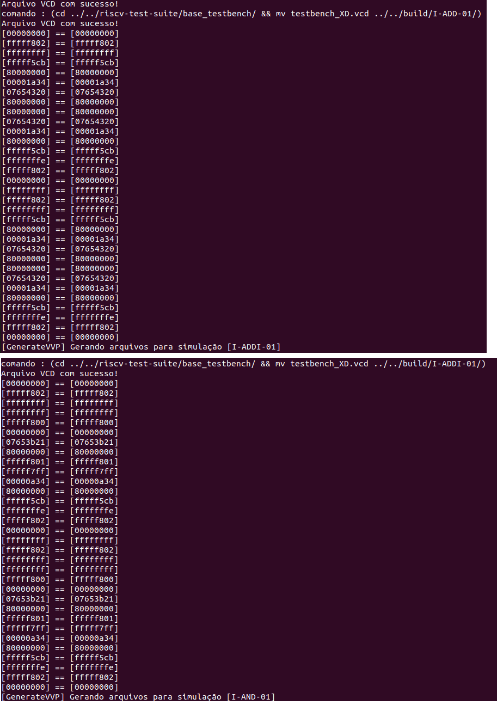


---
## 🛠️ Execution of Tests on Physical Device**

   To evaluate the SoC in a physical environment, the compliance tests from the official RISC-V repository were used. The SoC was synthesized on the icesugar-nano FPGA.

   In this way, all instructions and procedures carried out in the simulation environment are replicated and executed in the physical environment, ensuring the integrity of all original files.

   During execution, visual feedback is provided through the D1 pin, which corresponds to the PWM output. This feedback is indicated by a yellow LED, as illustrated in the subsequent figure. The red LED signals a write operation to the device's flash memory. When a test is successful, the yellow LED flashes (toggle effect) at a frequency of 1 Hz; in case of failure, it flashes at 2 Hz. This visual feedback offers users a clear and immediate understanding of the test status.

   Currently, the automated support for executing all tests from a given repository is primarily focused on the official tests of RISC-V. However, all tests produce a file compatible with the **SPI Test Interface**, which can be easily adapted for execution on a physical device. Details of this application will be presented in the following examples.

   

   

---
### 💌 Feedback & Contributions
Your feedback and contributions are highly welcomed and appreciated! Feel free to improve any part of this project and submit your ideas and enhancements.

---
Copyright (c) 2022-2023 Felipe Ferreira Nascimento
São Paulo, Brazil