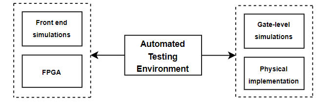

# 🚀 SoC RISC-V: An ASIC Implementation of the FEMTORV32
#### 🛠️ Designed by Felipe Ferreira Nascimento, São Paulo, Brazil.

---
## 🌐 Overview
The RISC-V architecture, an open-source ISA licensed under the Berkeley Software Distribution (BSD), has been gaining global recognition both in academic circles and in the market. The streamlined and expandable instruction set of this architecture allows for the implementation of versatile microarchitectures, suitable for both specific applications and general use. This project is dedicated to the full physical implementation of a SoC based on the RISC-V architecture, building on the FemtoRV32 project. The Quark core, which runs the base RV32I instruction set, was chosen for this implementation. This work is among the first to complete a full physical implementation of the Quark core, offering a validated microarchitecture that can be used in future ASIC projects. The initial implementation was carried out on a low-cost iCESugar-nano FPGA and was later transitioned to a 180 nm CMOS technology. The results show that the Quark core is a feasible option for cost-effective microprocessor projects, operating at frequencies above 120 MHz. One of the highlights of this project was the implementation of an automated testing environment, providing a framework for validation that spans from the front-end phase to the back-end. With the chip already in hand, future power characterization tests and other analyses are planned, aiming to assess the strengths and areas for improvement of the SoC.

## Advancements and Innovations in ASIC Technology Based on the RISC-V Architecture
The FemtoRV32 project focuses on the implementation of RISC-V processors and is derived from the renowned PicoRV32, optimized for RISC-V CPUs, serving as a foundation for innovations in this architecture, as exemplified by the Raven SoC [Raven](https://github.com/efabless/raven-picorv32). This, in turn, underwent physical implementation and chip fabrication through the open silicon PDK from Efabless, using a 180 nm CMOS process. However, the results of the physical synthesis and consumption estimates are not available. This process actualized and made the PicoRV32 project feasible in a real implementation, highlighting the core's versatility for reuse in ASIC projects. Thus, this project aimed to expand these possibilities for the FemtoRV32 project, providing significant contributions so it can serve as a solid foundation in the development of new solutions. This is the first work that undertook such an initiative.

🔗 [FemtoRV32 Project](https://github.com/BrunoLevy/learn-fpga/tree/master/FemtoRV)
- 📄 Copyright (c) 2020-2021, Bruno Levy
- 📜 All rights reserved.

---
## 🛠 Requirements
To simulate the SoC, the following tools are needed:
- [Iverilog](http://iverilog.icarus.com)
- RISC-V GCC configured for Femtorv32 or picoRV32 processor design.

💡 **Tip:** Acquire the correct GCC cross-compiler by installing the picoRV32 source from [GitHub](https://github.com/cliffordwolf/picorv32).

---
### Contextualization
Although the ARM and x86 architectures are widely used, their restrictive licensing model poses a barrier to academic and experimental exploration. Developing a microprocessor is already, in itself, a task that involves multiple complex stages. Furthermore, the licensing constraints of these architectures often result in significant costs. On the other hand, the RISC-V ISA, with its open-source model, provides a more flexible alternative. This allows companies and academic institutions to develop customized microprocessors without the complications associated with intellectual property licenses. This open environment encourages investment in research and development.
However, the physical implementation of RISC-V processors remains a significant challenge. Many microarchitectures, even when validated in simulations or FPGAs, do not proceed to application in actual manufacturing technologies. This gap is largely due to the complexity and costs associated with creating and manufacturing an operational silicon chip. Actual VLSI design involves several intricate phases, from chip design and layout to post-layout checks and simulations. Therefore, it's essential to validate the feasibility of RISC-V microarchitectures in practical contexts, taking into account the real-world physical constraints that differ significantly from ideal conditions in simulations and FPGAs.

---
## Motivation
The open-source RISC-V architecture promotes innovation and freedom in the microelectronics field, benefiting both individuals and the community. It allows manufacturers to develop products with intellectual property while retaining the flexibility to implement non-standard instruction subsets. This environment stimulates investment in research and development, driving innovation from startups to large corporations. Renowned companies like Google, IBM, Nvidia, and Samsung are among the investors in the RISC-V Foundation.
The rising global significance of RISC-V and open-source development led the Aeronautics Institute of Technology (ITA) to launch the "ITA CORES" initiative in 2022. Focused on research about the design and fabrication of digital processors based on the RISC-V ISA, this initiative aligns with global trends and the demand for more accessible and innovative technologies.
Physical implementation in CMOS technology not only validates performance and energy efficiency but also ensures the processor's quality and reliability in a context similar to commercial products. Comparative analyses between different implementations of the same microarchitecture provide opportunities for future enhancements.
Given the complexities of the digital flow and the scarcity of material in the current Brazilian literature, there is a clear need to document this information. Such documentation can accelerate the learning of students interested in microelectronics, filling a significant gap in the educational landscape.
The exploration of these topics serves as a hands-on example for students and researchers interested in the RISC-V ISA and SoC design. Sharing information and experiences has the potential to broaden knowledge about this open architecture, and it is believed that this initiative can encourage the community to collaborate in the development of innovative solutions based on RISC-V.

---
## 🌟 ITA-CORES Initiative
Acknowledging the global advancements in RISC-V and Open Source, ITA introduced the "ITA CORES" initiative focusing on designing and manufacturing digital processors based on the RISC-V ISA.

---
## 🧠 SoC RISC-V Implementation
This project aimed to implement and physically validate the Quark core, ideal due to its compact microarchitecture for low-cost implementations.

### 🛠 Methodologies and Tools
We explored essential methodologies and tools necessary for a complex digital flow, targeting the efficient implementation and validation of the core.

---
## 📚 Framework Details
In digital chip development, optimizations often lead to modifications in the original design, which, although intended for improvements, can introduce errors or inconsistencies.

### 🛠 Developed Framework
This project developed a framework to verify the conformity of the Quark core with the ISA RISC-V specifications.

#### 🌀 Functioning and steps of the framework
The framework operates through several stages, managing test files, setting up test environments, compiling with the RISC-V toolchain, organizing compiled files, preparing instructions for simulation, automated test execution and validation, and finally, executing tests on a physical device.

1. **Stage 1: Test File Management**
   - System identifies and manages the test files, which are stored in five main repositories, supporting test files written in both C language and RISC-V assembly.

2. **Stage 2: Test Environment Setup**
   - Application prepares the automated testing environment through a series of specialized scripts.

3. **Stage 3: Compilation with the RISC-V Toolchain**
   - The application uses the RISC-V toolchain to convert the test files into executable machine code.

4. **Stage 4: Organization of Compiled Files**
   - The files and their dependencies are organized in specific directories for each test.

5. **Stage 5: Preparation of Instructions for Simulation**
   - The resulting .elf files are converted into instructions in hexadecimal format suitable for digital simulators used in the project.

6. **Stage 6: Automated Test Execution and Validation**
   - This stage involves the execution and automated validation of each test, providing visual feedback on the test status.

7. **Stage 7: Execution of Tests on Physical Device**
   - This stage involves setting up and executing the tests on hardware, such as an FPGA or physical chip.

## 🛠 Framework Execution Guide

### 📁 Directory Preparation

1. **Initial Setup**  
   Navigate to the directory: `femtorv32/FemtoRV/Frontend/scripts`. This repository stores the main codes used in the development of the framework.

2. **Framework Construction**  
   In your terminal (ensure you're in the path indicated above), type:  `sudo make all ENV_FRONTEND_SIGNOFF=1`
   This command constructs the framework, primarily considering the environment for simulation execution. This step encompasses the compilation of files and dependencies essential for the framework's execution.
   Upon completion, a `bin` folder will be created in the `/scripts/bin` directory, storing the compiled binaries.

### 🖥 Framework Interface
   
   Upon the successful setup, running the framework will display a user interface showcasing the available functions as outlined in the [Functioning and steps of the framework](#-functioning-and-steps-of-the-framework) section.

   

   For a practical demonstration, the image below showcases the interface when executing the official RISC-V conformity tests, i.e., option 1.

   

### 📂 File Organization & Test Execution

   After test execution, you can locate the generated files in the `../build` directory. This directory organizes each test individually, identified by their respective names.

   

   When accessing a specific test directory, the following file structure can be observed:

   - `.bin` - Binary file for physical devices.
   - `.elf` - Executable and linkable file.
   - `.hex` - Executable instruction file.
   - `_firmware.hex` - Formatted file for digital simulators.
   - `_firmware_spi.v` - SPI interface file.
   - `testbench_XD.vcd` - Resulting simulation file.

   For example, the `ADD` instruction test might present:

   

   Following the test's completion, the resulting log file can be found in `../build`. Utility and linker files for the processor are located in `../firmware`, while intermediary files for test execution are in `../test_repository_name/base_testbench`. Where 'teste_repository_name' refers to the name of the test in question.

   

   For execution tests related to the LowRISC project, consider:

   1. Navigate to the directory: `femtorv32/FemtoRV/Frontend/scripts`.
   2. In your terminal, type: `sudo make all ENV_FRONTEND_SIGNOFF=1`.
   3. Select option 2. The necessary dependencies will be verified.
   4. The following image illustrates a sample execution, where several operations are performed. Ultimately, a signature is generated and compared with the reference signature found in `../riscv-test-suite/references`. Test coverages can also be located in this repository.

   

   

---
### 💌 Feedback & Contributions
Your feedback and contributions are highly welcomed and appreciated! Feel free to improve any part of this project and submit your ideas and enhancements.
